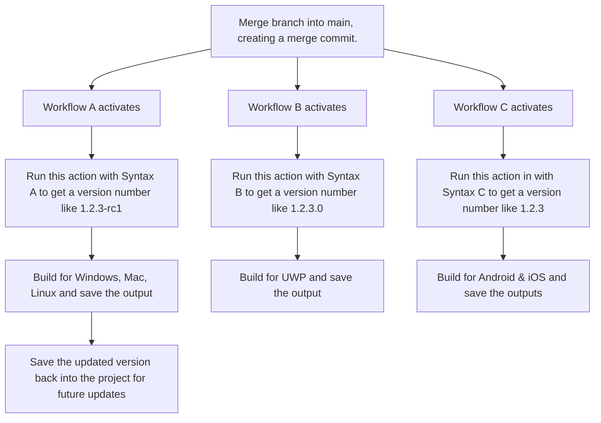

# Unity Automated Semver

Github Action to increment relevant project settings "version" numbers per semantic versioning.

Read more about semantic versioning and its spec on the website: [https://semver.org/](https://semver.org/)


## Platform Version String Info

Since Unity supports a variety of platforms, and those platforms have different expectations of a version string, you may want to structure the action's string format per the following.

- Android: 
  - `${major}.${minor}.${patch}`
- iOS, tvOS, visionOS: 
  - `${major}.${minor}.${patch}`
- Standalone (Windows, Linux, macOS) or Dedicated Server<sup>1</sup>: 
  - `${major}.${minor}.${patch}-${releaseLabel}+${buildLabel}`
- Nintendo Switch<sup>1</sup>: 
  - `${major}.${minor}.${patch}-${releaseLabel}+${buildLabel}`
- UWP (Microsoft Store and Xbox One): 
  - `${major}.${minor}.${build}.${revision}`
- PlayStation 4 & 5<sup>2</sup>: 
  - `${major}.${minor}`
- WebGL:
  - Nothing specifically stated in the Unity manual. Go crazy, try any of the above formats.

1. These platforms can also work just fine with `${major}.${minor}.${patch}` format, or omit either or all of the releaseLabel or buildLabel properties.
2. I (Alex) don't have access to PlayStation game development documentation and thus have no idea what their rules are, beyond whatever the Unity Manual and ProjectSettings.asset file expose normally. If the version string must be something other than "01.01", let us know!

You may want to use a thorough format syntax with all properties to store all information in the version string and save that to your project when doing branch merges. Then when you do per-platform build automation workflows, you could modify the version number with platform-specific syntax _without saving it_ so that your per-platform builds have appropriate version strings.

These platforms below do not have information about platform-specific versioning in their Unity manual pages, so I can only assume that they are using the standard `bundleVersion` property that the `default` mode of this action will update. 

- **macOS**: Has a "build" property for a build number of a version of the app. Nothing noted for "version" though.


So, all that is to say that these properties within the `ProjectSettings.asset` file of a given Unity project will be updated, if they already exist:

- bundleVersion
- tvOSBundleVersion
- visionOSBundleVersion
- switchDisplayVersion
- metroPackageVersion
- XboxOneVersion

If a property that needs to be updated is not listed above, please [make an issue](https://github.com/AlexStormwood/UnityAutomatedSemver/issues/new/choose) and let us know.

## Unity's Versioning System

Unity's versioning system is a mess. Or rather, the platforms that Unity has to cater to are just not consistent.

This action lets you define a version string syntax, as explained above.

However, this means that if you need a version numbering style for one platform and a different version numbering style for another platform, you must run this action twice.

For example:



## Inputs

This is the data that you must set up in your own workflow file to use this action properly.

### semver-update-type

When calling this action, you can specify the type of semver update you'd like to perform. Suitable values are:

* major 
* minor
* patch
* build
* revision
* auto

These properties have a priority order.  Whichever property is chosen will increment by one, and reset the lower-priority values to zero.

For example, if you have a semver string like "1.2.3", and set this input value to "major", then the new semver string will be "2.0.0".

This is because semver strings follow this priority rule:

`major -> minor -> patch`

Builds and revisions are not within the semver spec and will be treated as lowest priority items in that numbering system.

If this is set to `auto`, then the repository that this action is used in must follow these requirements:

- use [conventional commit syntax](https://www.conventionalcommits.org/en/v1.0.0/) in its commits 
- create GitHub Releases where the project's version is the tag used for the release


## treat-build-as-patch (optional)

Defaults to true.

This property allows your patch and build numbers to be identical. This is useful if you're doing a multi-platform project, where you need the build number for UWP platforms and the patch number for non-UWP platforms, and still use the same numbers across each platform.

Patches are higher priority than builds since patches are in the semver spec and builds are not, so if build and patch both have data, then build be assigned the value that patch has. The patch value never gets overwritten by the build value.

For 99.9999% of use cases, just leave this as-is.

# major (optional)

If you want to hard-code this property to specific number, set this to a number. 

This value is applied _after_ any semver incrementing operation has completed, so it will override any value set to it.

# minor (optional)

If you want to hard-code this property to specific number, set this to a number. 

This value is applied _after_ any semver incrementing operation has completed, so it will override any value set to it.

# patch (optional)

If you want to hard-code this property to specific number, set this to a number. 

This value is applied _after_ any semver incrementing operation has completed, so it will override any value set to it.

# build (optional)

If you want to hard-code this property to specific number, set this to a number. 

This value is applied _after_ any semver incrementing operation has completed, so it will override any value set to it.

# revision (optional)

If you want to hard-code this property to specific number, set this to a number. 

This value is applied _after_ any semver incrementing operation has completed, so it will override any value set to it.

# releaseLabel (optional)

The string to assign to the `releaseLabel` value used in the semver string.

# buildLabel (optional)

The string to assign to the `releaseLabel` value used in the semver string.

Note that this is NOT the `build` property that is used by other inputs. `build` must be a number, `buildLabel` is a string.

### project-settings-path (optional)

The path to the ProjectSettings/ProjectSettings.asset file for your unity project. If not specified will action will attempt to automatically find it.


## Outputs 

This is the data that you can use after this action has completed, in other actions & scripts.

### semver-string

This represents the semantic version string _after_ this action has been performed - it will reflect the new, updated version string.

### semver-number 

Alias of `semver-string`, just to avoid breaking existing workflows that might depend on this output.

May get removed one day - as long as it's clear that this output is a string data type, and not a number data type.


## Example Usage

In your repository containing a Unity project, you should have a Github Actions workflow file set up in your `.github/workflows` directory. Name it whatever you want (as long as it ends in ".yml"!). After letting this action run, you then have to sort out committing & pushing the changed file(s) to your repo from within the workflow. The example code below shows all of this; it updates the patch number in every push made to the repository. 

Currently, the big downside to this process is that all developers working on the repo must then fetch & pull the changes made by this action. No one should be editing the `ProjectSettings.asset` file anyway so this shouldn't cause any merge or pull/push issues, but still worth noting.

```yaml
name: Update Unity project semantic versioning

on: [push]

jobs:
  create:
    name: Update semver
    runs-on: ubuntu-latest
    
    steps:
      # You must ALWAYS checkout your repo so that actions in the workflow can use it.
      - name: Checkout 
        uses: actions/checkout@v4

      - name: Find ProjectSettings.asset & increment its bundleVersion number
        uses: AlexStormwood/UnityAutomatedSemver@v1.1.0 # Change v1.1.1 to whatever tag is newer in the AlexStormwood/UnityAutomatedSemver repository.
        id: semver-update
        with:
          semver-update-type: 'patch' # Change this string to any suitable string mentioned in the Inputs section of this action's readme to suit your needs.
          project-settings-path: 'ProjectSettings/ProjectSettings.asset' # optional: specify the exact location of the ProjectSettings file, otherwise action will attempt to automatically find it.

      # Validate that the number has been incremented correctly.
      - name: Get the new semver number
        run: echo "The new semver number for this Unity project is ${{ steps.semver-update.outputs.semver-number }}"

      # Commit & push the updated semver number back into the repo. Yes, you have to fetch & pull in your local workstation after this step is done.
      - name: Push changed files back to repo
        uses: stefanzweifel/git-auto-commit-action@v5
        with:
          commit_message: "Updated semver via automated action."
          commit_options: '--no-verify --signoff'
```


### For Large Projects

If your project takes a long time to checkout in git, you may benefit from doing a sparse checkout when running this action. We don't need your entire Unity project to be checked out into the action runner's workspace, we just need the `ProjectSettings.asset` file to be somewhere in the action runner's workspace.

For example, if the ProjectSettings folder is in the root of the repo, then this variation of the checkout step will checkout just that folder. Since it includes the `ProjectSettings.asset` file within that folder, and no paths are changed by a sparse checkout, the rest of a workflow using this action can remain unchanged.

```yaml
 - name: Checkout 
        uses: actions/checkout@v4
        with:
          sparse-checkout: ProjectSettings
```

As long as the `ProjectSettings.asset` file exists somewhere in the action runner's workspace, this action will find it and be able to update it.

## To-Do List

* General code optimizations
* Double-check & implement support for non-standard Unity target platforms (in case not all target platforms respect the bundleVersion property)
* Create more example workflows
